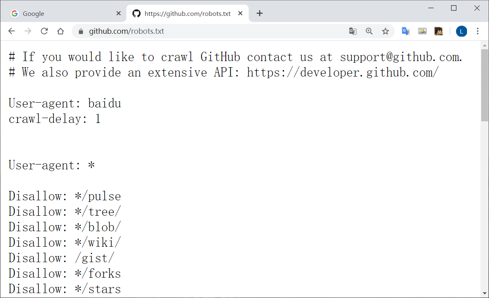

爬虫可以做：

*   采集网络数据
*   自动化测试
*   做一些脱离手动的操作（帮人投票，12306抢票，微信聊天助手）
*   灰产

需要知识

*   计算机网络（http/https协议，tcp/ip协议，socket编程）
*   前端基础
*   正则表达式
*   数据存储技术（分布式存储）
*   并发处理技术
*   图像识别（处理反爬，验证码），机器学习算法（验证码，数据解析）

面对的问题：

*   爬虫的采集和更新策略
*   解决反爬
*   数据解析
*   数据存储
*   模拟登陆（验证码识别）
*   爬虫的监控和部署
*   数据的去重（url去重，内容去重）

看待爬虫

*   爬虫不应该毫无节制
*   robots协议（指定了爬虫可以爬取的内容）
*   法律问题
*   爬虫不能抓取页面上看不到的数据，是为了防止重复工作
*   网站通常存在反爬机制

通过在网站目录的根地址后加上 `/robots.txt` 可以查看该网站的robots协议

