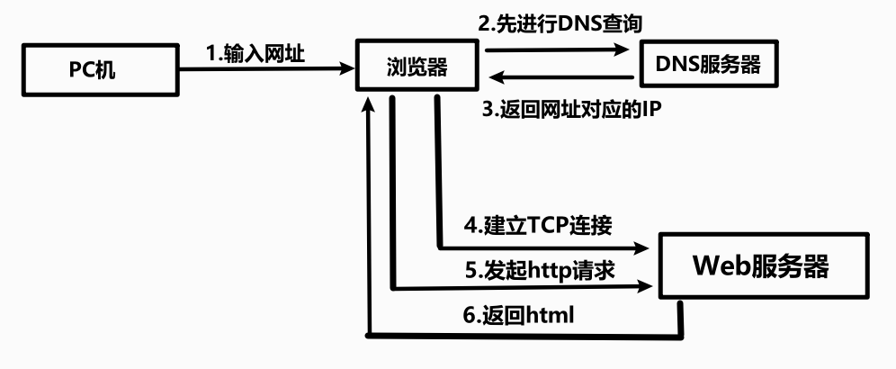

## 网络协议

一个完整的网络请求过程

## IP地址和URL

### IP地址

*   网络传输好比快递，数据是包裹
*   IP地址就是门牌号

### 动态IP和静态IP

*   地址格式    `xxx.xxx.xxx.xxx` 总长度是32位
*   一般的PC机，终端都为局域网内部IP（动态），不会真正地占用IP资源
*   在局域网内部的设备与外界互通，都需要路由器的IP转发

### `url`

格式

