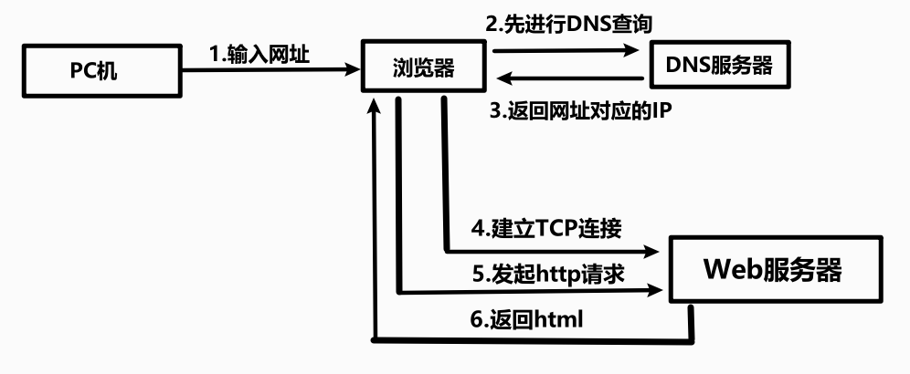
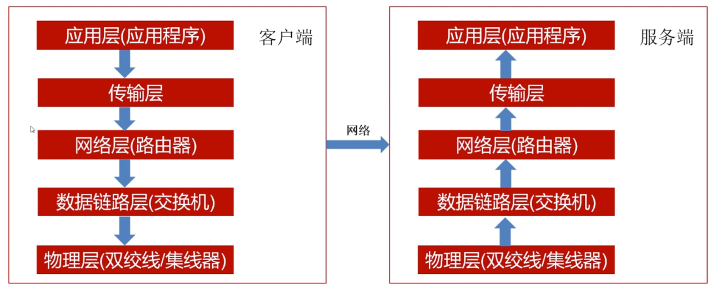

## 网络协议

一个完整的网络请求过程

## IP地址和URL

### IP地址

*   网络传输好比快递，数据是包裹
*   IP地址就是门牌号

### 动态IP和静态IP

*   地址格式    `xxx.xxx.xxx.xxx` 总长度是32位
*   一般的PC机，终端都为局域网内部IP（动态），不会真正地占用IP资源
*   在局域网内部的设备与外界互通，都需要路由器的IP转发

### `url`

格式

## 七层网络协议

简化为  五层

*   应用层（应用程序）   `Http  FTP   POP3  DNS`
*   传输层   `TCP   UDP`
*   网络层   `ICMP  IP  IGMP`
*   数据链路层（交换机）   `ARP   RARP`
*   物理层（双绞线/集线器）

数据传输是先由上向下    再由下往上

因为集线器，路由器，操作系统已经实现了协议，我们直接调用接口即可

即**采用socket编程** 

### TCP/IP协议

#### IP协议

用于将多个数据包交换网络连接起来  它在源地址和目的地址之间传输数据包

给数据片段 贴上标签  让数据片段成为数据包  标签包括 “源IP地址”  和  “目标IP地址”

*   IP地址 是IP协议提供的一种同一的地址格式
*   逻辑地址  可以修改

#### TCP协议

*   TCP协议负责把需要传输的数据分解成一定长度的“片段”

*   TCP是一种面向连接的单播协议，在发送数据前，通信双方必须在彼此间**建立一条连接**。所谓的“连接”，其实是客户端和服务器的内存里保存的一份关于对方的信息，如IP地址、端口号等

*   TCP可以看成是一种字节流，它会处理IP层或以下的层的丢包、重复以及错误问题。在连接的建立过程中，双方需要交换一些连接的参数。这些参数可以放在TCP头部

#### 路由器

是连接互联网各局域网  广域网的设备，会根据信道的情况自动选择和设置路由，以最佳路径，按前后顺序发送数据

每个节点上的路由器都记录着与自己相邻的路由器地址，并形成一个表格-**路由表**，路由表是一个动态数据库，并在网络活动中不断更新
数据包达到一个路由器后，该路由器会根据数据包的地址信息，查询路由表，然后选择一个最佳的路径发送数据包

