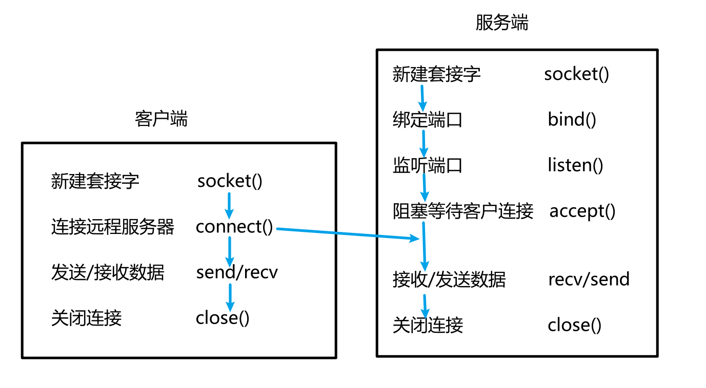
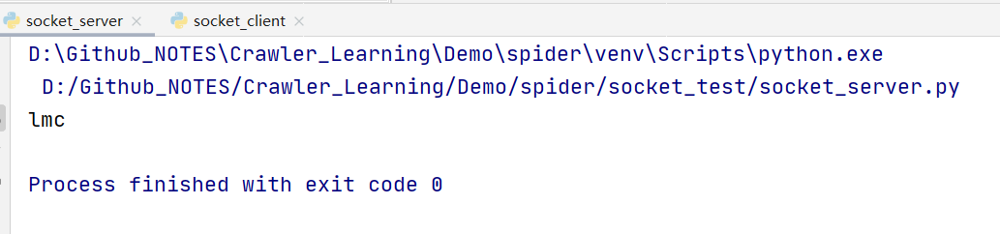
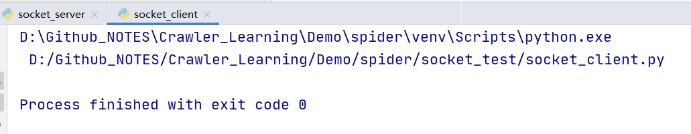

Socket请求连接过程图




### 一个例子

socket服务端

```python
# socket 服务端

import socket

server = socket.socket()
# 绑定到 0.0.0.:8080端口上
server.bind(('0.0.0.0', 8000))
server.listen()

# 阻塞等待连接
sock, addr = server.accept()
data = ""

while True:
    tmp_data = sock.recv(1024)
    if tmp_data:
        data += tmp_data.decode("utf-8")
    else:
        break

if __name__ == "__main__":
    print(data)
    sock.close()
```

### socket客户端

```python
# socket 客户端

import socket

client = socket.socket()

client.connect(('192.168.1.113', 8000))
# 发送数据  要保证编码解码一致
client.send("lmc".encode("utf8"))


if __name__ == "__main__":
    client.close()
```

先运行服务端  再运行客户端

客户端接收到数据




