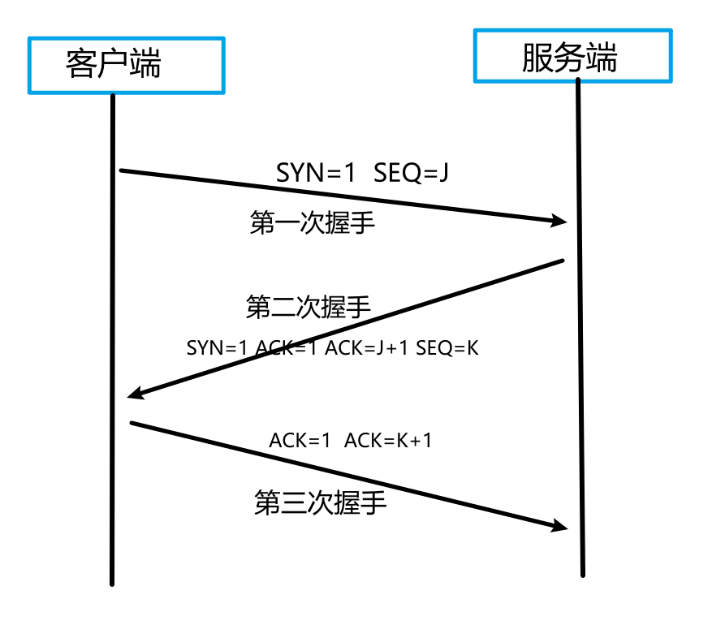

TCP协议

建立连接时，进行三次握手  断开连接时， 进行三次挥手

>   在Google Groups的`TopLanguage`中看到一帖讨论TCP“三次握手”觉得很有意思。贴主提出“TCP建立连接为什么是三次握手？”的问题，在众多回复中，有一条回复写道：“这个问题的本质是, 信道不可靠, 但是通信双发需要就某个问题达成一致. 而要解决这个问题, 无论你在消息中包含什么信息, 三次通信是理论上的最小值. 所以三次握手不是TCP本身的要求, 而是为了满足"在不可靠信道上可靠地传输信息"这一需求所导致的. 请注意这里的本质需求,信道不可靠, 数据传输要可靠. 三次达到了, 那后面你想接着握手也好, 发数据也好, 跟进行可靠信息传输的需求就没关系了. 因此,如果信道是可靠的, 即无论什么时候发出消息, 对方一定能收到, 或者你不关心是否要保证对方收到你的消息, 那就能像UDP那样直接发送消息就可以了.”。这可视为对“三次握手”目的的另一种解答思路

